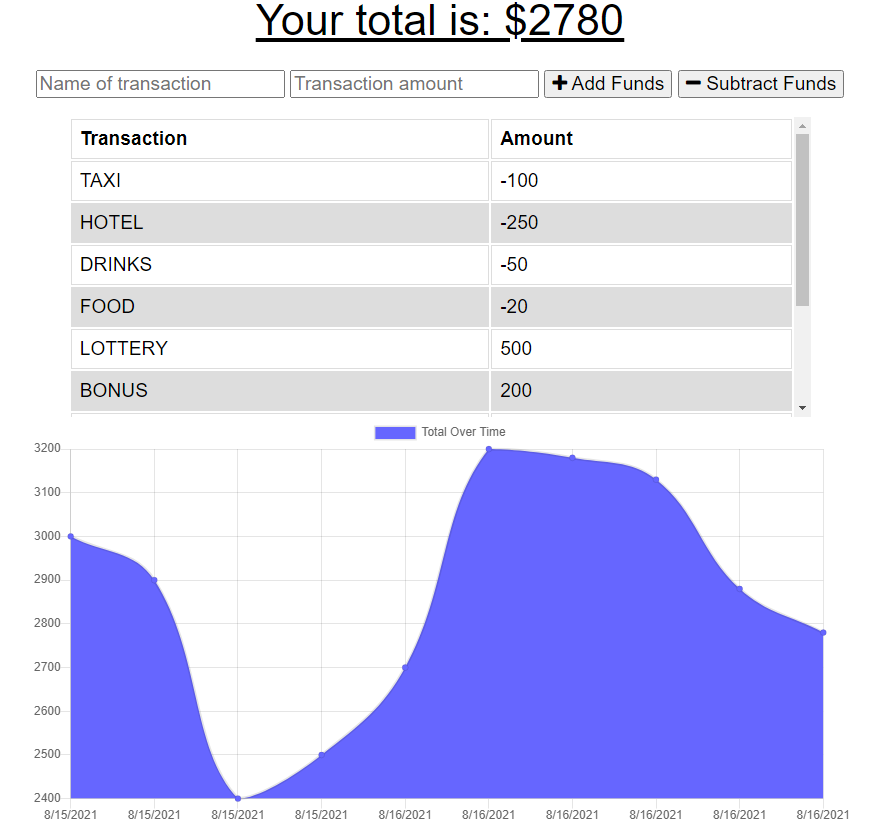

# Offline Budget Tracker

## Description 
This is a Progressive Web App (PWA) of a simple budget tracker that allows you to use the app offline. Once the app establishes internet connection again, all offline inputs are saved and updated. 

## How to Use
1. Point your browser to : <a href="https://still-plains-20704.herokuapp.com//">Offline Budget Tracker</a>
2. Enter the name of your transaction you would like to track and the amount, followed by the add or subtract buttons. 

    
3. If connection is lost, your entries will be saved and updated when connection is re-established. 

